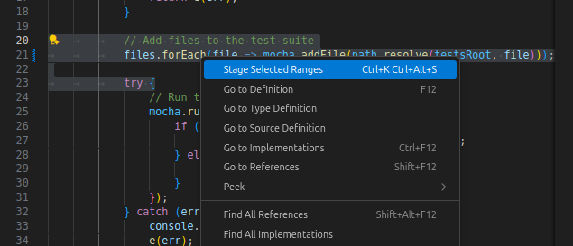

# Stage Selected

A VS Code extension that adds a convenient "Stage Selected" option to the editor context menu, allowing you to stage only selected portions of your files to Git.



## Features

- **Context Menu Integration**: Right-click on selected text to see the "Stage Selected" option
- **Granular Git Control**: Stage only the specific lines you want, not the entire file
- **Seamless Workflow**: Works with your existing Git workflow in VS Code

## How to Use

1. Select the text you want to stage in any file
2. Right-click to open the context menu
3. Click "Stage Selected" to stage only your selected text
4. Continue with your normal Git workflow (commit, push, etc.)

## Requirements

- VS Code 1.79.0 or higher
- Git repository initialized in your workspace
- VS Code's built-in Git extension enabled

## Installation

### From VS Code Marketplace
1. Open VS Code
2. Go to Extensions (Ctrl+Shift+X)
3. Search for "Stage Selected"
4. Click Install

### From VSIX File
1. Download the `.vsix` file from the releases
2. Open VS Code
3. Go to Extensions (Ctrl+Shift+X)
4. Click the "..." menu and select "Install from VSIX..."
5. Select the downloaded file

## Development

### Building from Source
```bash
# Clone the repository
git clone https://github.com/camchambers/stage-selected.git
cd stage-selected

# Install dependencies
npm install

# Compile the extension
npm run compile

# Run tests
npm test
```

### Package Extension
```bash
# Package into VSIX file
npm run package
```

## Contributing

Contributions are welcome! Please feel free to submit a Pull Request.

## License

This extension is licensed under the MIT License. See [LICENSE.txt](LICENSE.txt) for details.

## Support

If you encounter any issues or have feature requests, please file them in the [GitHub Issues](https://github.com/camchambers/stage-selected/issues) section.

---

**Enjoy staging your selected code! 🚀**